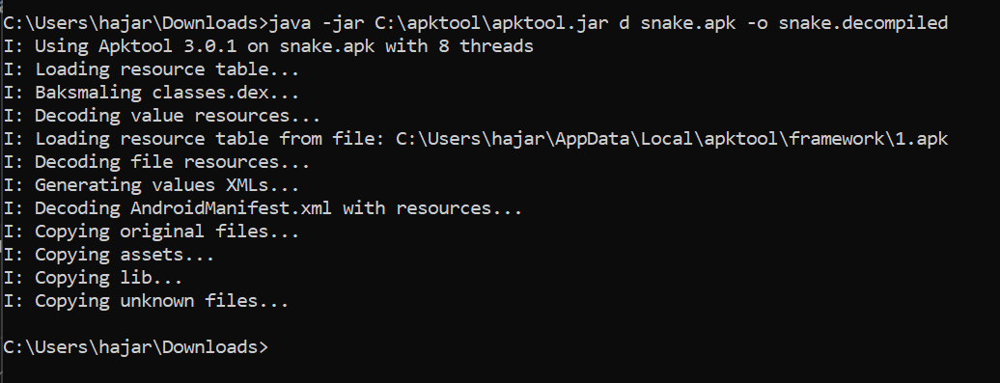
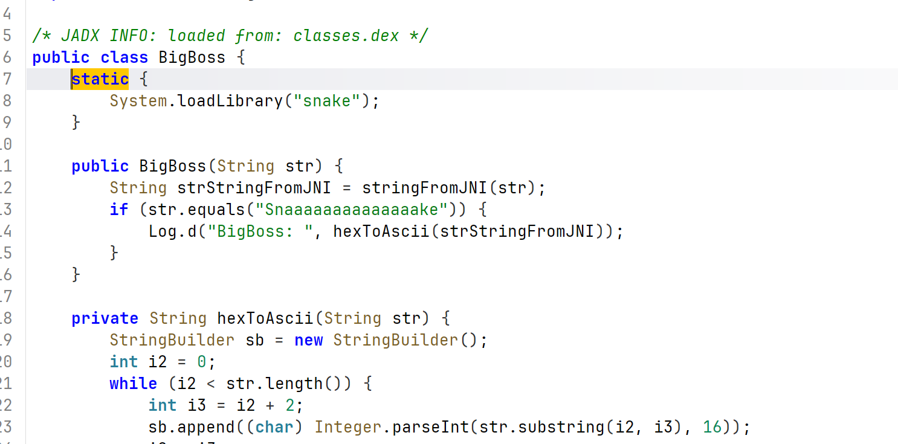
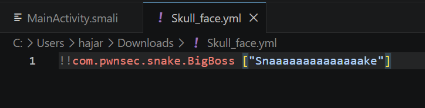
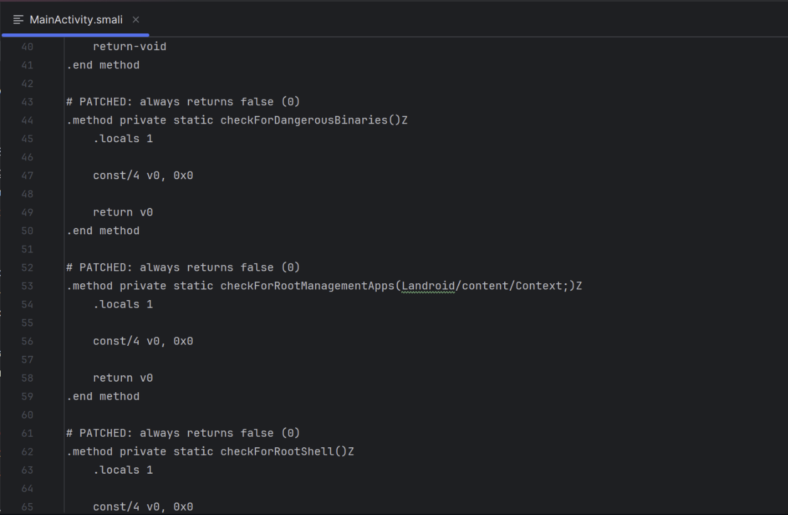
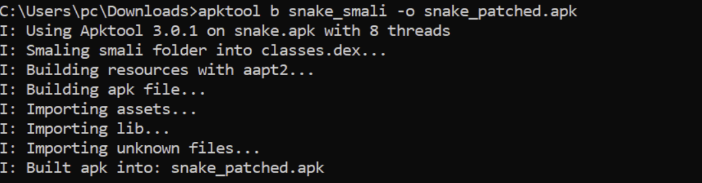
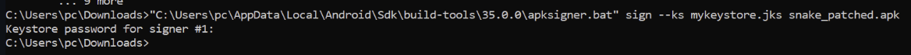
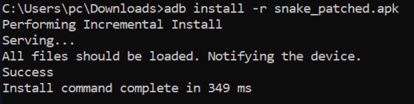
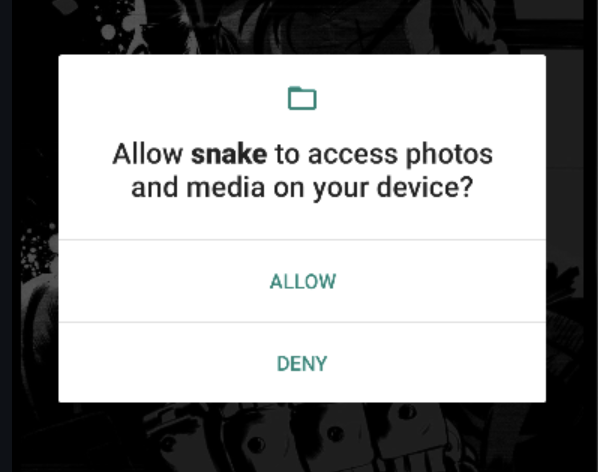
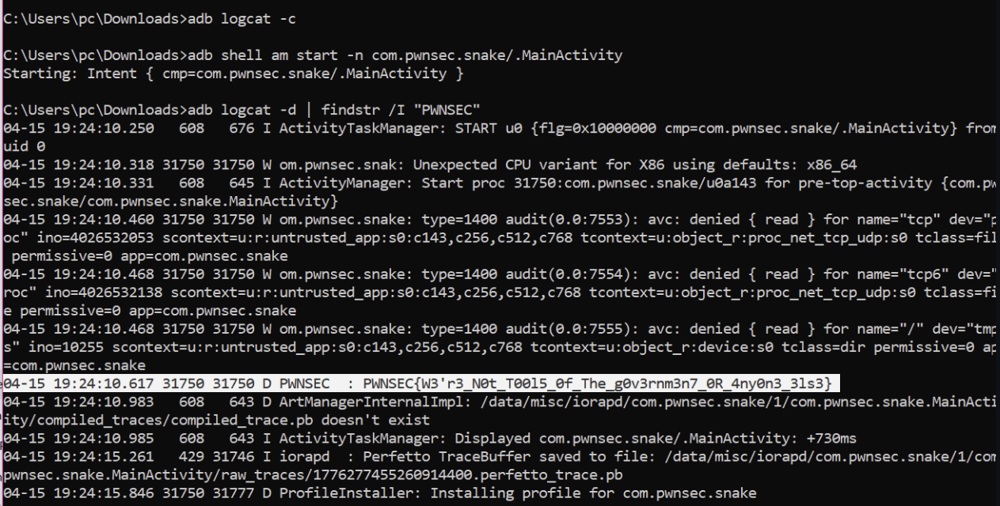

<h1 align="center"> Résolution de LAB : Snake </h1>


##  Objectif

Analyser une application Android (`snake.apk`), contourner ses mécanismes de protection, et récupérer le **flag caché** en combinant :

- Analyse statique (JADX / APKTool)
- Modification du bytecode (Smali)
- Analyse dynamique (logcat)

---

##  Étape 1 : Décompilation de l’APK

Nous commençons par décompiler l’application avec APKTool :

```bash
java -jar apktool.jar d snake.apk -o snake_decompiled
```

<p align="center">  <br> <em>Figure 1 : Décompilation de l'APK avec APKTool</em> </p>

Explication :
Cette étape permet d’extraire :

- le code Smali (.smali)
- les ressources (res/)
- le manifest Android

---

##  Étape 2 : Analyse avec JADX

Ensuite, nous analysons le code avec JADX pour comprendre la logique de l’application.

<p align="center">  <br> <em>Figure 2 : Analyse de la classe BigBoss</em> </p>

 Points importants observés :

Chargement d’une librairie native :
```
System.loadLibrary("snake");
```

Appel à une fonction JNI :
```
stringFromJNI(str)
```

Condition critique :
```
if (str.equals("Snaaaaaaaaaaaaaake"))
```

 Cela signifie que si on passe cette chaîne exacte, une valeur sera loguée.

---

##  Étape 3 : Analyse des fichiers internes

Nous trouvons une référence intéressante dans un fichier YAML :

<p align="center">  <br> <em>Figure 3 : Chaîne spéciale utilisée par BigBoss</em> </p>

```
com.pwnsec.snake.BigBoss ["Snaaaaaaaaaaaaaake"]
```

 Ceci confirme la valeur à utiliser comme input.

---

##  Étape 4 : Contournement des protections

L’application possède des protections anti-root :

- checkForDangerousBinaries()
- checkForRootManagementApps()
- checkForRootShell()

Nous allons les neutraliser en modifiant le code Smali.

<p align="center">  <br> <em>Figure 4 : Patch des fonctions de détection</em> </p>

 Modification effectuée :

```smali
const/4 v0, 0x0
return v0
```

 Cela force toutes les fonctions à retourner false, donc :
 aucune détection root  
 aucune protection active  

---

##  Étape 5 : Rebuild de l’APK

```bash
apktool b snake_decompiled -o snake_patched.apk
```

<p align="center">  <br> <em>Figure 5 : Reconstruction de l'APK</em> </p>

---

##  Étape 6 : Signature de l’APK

```bash
apksigner sign --ks mykeystore.jks snake_patched.apk
```

<p align="center">  <br> <em>Figure 6 : Signature de l’APK</em> </p>

---

##  Étape 7 : Installation

```bash
adb install -r snake_patched.apk
```

<p align="center">  <br> <em>Figure 7 : Installation réussie</em> </p>

---

##  Étape 8 : Lancement de l’application

<p align="center">  <br> <em>Figure 8 : Demande de permission</em> </p>

<p align="center">  <br> <em>Figure 9 : Interface principale</em> </p>

---

##  Étape 9 : Analyse dynamique avec logcat

Nous allons maintenant observer les logs système :

```bash
adb logcat -c
adb shell am start -n com.pwnsec.snake/.MainActivity
adb logcat -d | findstr /I "PWNSEC"
```

<p align="center">  <br> <em>Figure 10 : Extraction du flag depuis logcat</em> </p>

---

##  Flag trouvé

```
PWNSEC{W3'r3_N0t_T0015_0f_Th3_g0v3rnm3n7_OR_4ny0n3_3ls3}
```

---

##  Explication globale

 Ce que fait l’application :

- Charge une librairie native (snake.so)
- Attend une chaîne spécifique (Snaaaaaaaaaaaaaake)
- Transforme une valeur via JNI
- Log le résultat

 Pourquoi ça fonctionne :

- Le flag est logué dans logcat
- Les protections root bloquent normalement l’exécution
- En les désactivant → accès direct au log

 Failles exploitées :

-  Hardcoded string
-  Mauvaise protection root
-  Données sensibles dans logcat
-  Logique critique côté client

---

##  Conclusion

Ce lab montre que :

 Les protections côté client ne suffisent pas

Même avec :

- du code natif
- des vérifications root

 Un attaquant peut :

- patcher l’application
- bypass les protections
- récupérer les données sensibles

